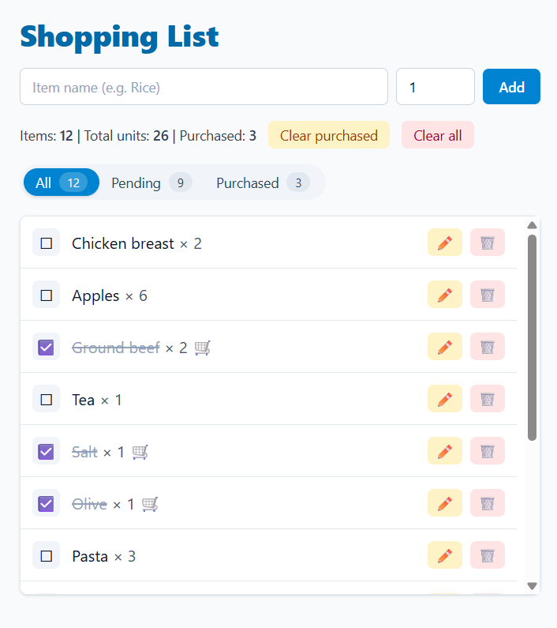

# React Shopping List (Vite + TypeScript)

A small SPA to manage a shopping list.  
This project demonstrates modern React with TypeScript, clean structure, and clear code comments in English.

## Live Demo
https://react-shopping-list-mgomez.vercel.app

## Screenshot

  

## Features (MVP)
- 🧠 Global state with **Context + Reducer** (typed actions & state)
- ➕ Add items, ✏️ inline edit (name & quantity), ✅ toggle purchased, 🗑️ delete
- 🧹 **Clear purchased** and **Clear all**
- 🔎 **Filter pills** (All / Pending / Purchased) with live counters
- 💾 **LocalStorage** persistence (per domain)
- 🎨 **Tailwind CSS v4** styles (via `@tailwindcss/postcss`)
- ♿ Accessible basics (labels, focus states, keyboard Enter/Escape on edit)
- 🚀 Deployed on **Vercel** (CI on push to `main`)

## Tech Stack
- React 18 + TypeScript
- Vite
- Tailwind CSS v4
- (Deployment) Vercel

## Getting Started

    npm install
    npm run dev
    # open http://localhost:5173

### Production build & preview

    npm run build
    npm run preview
    # open http://localhost:4173

## Project Structure
    react-shopping-list/
    ├─ src/
    │  ├─ components/
    │  │  ├─ FilterBar.tsx
    │  │  ├─ FilterBarContainer.tsx
    │  │  ├─ ItemForm.tsx
    │  │  ├─ ItemList.tsx
    │  │  └─ ItemRow.tsx
    │  ├─ context/
    │  │  ├─ ShoppingContext.tsx      # Provider + hook + localStorage sync
    │  │  └─ shoppingReducer.ts       # Reducer, actions, initialState
    │  ├─ domain/
    │  │  ├─ models.ts                # Item types
    │  │  └─ filters.ts               # StatusFilter types
    │  ├─ App.tsx
    │  ├─ main.tsx
    │  └─ index.css                   # Tailwind entry (@import "tailwindcss")
    ├─ public/                        # (Vite: it’s empty or with a favicon)
    ├─ postcss.config.cjs
    ├─ tailwind.config.cjs
    ├─ tsconfig.json
    ├─ vite.config.ts
    └─ README.md

## Architecture Notes
- **State management:** Context + Reducer (pure functions, predictable updates).
- **Persistence:** `localStorage` under the key `shopping_state`.
- **UI state vs. app state:** the current filter is UI state (component), items are global (context).
- **Tailwind v4:** configured with `postcss.config.cjs` and `tailwind.config.cjs`; CSS entry uses `@import "tailwindcss"`.

## Next Steps (nice-to-haves)
- ✅ Unit tests with **Vitest + React Testing Library**
- Sorting & simple categories/priorities
- Basic empty states and micro-animations
- ESLint + Prettier config

## License
This project is licensed under the **MIT License**. See `LICENSE` for details.
